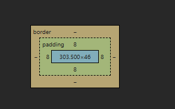
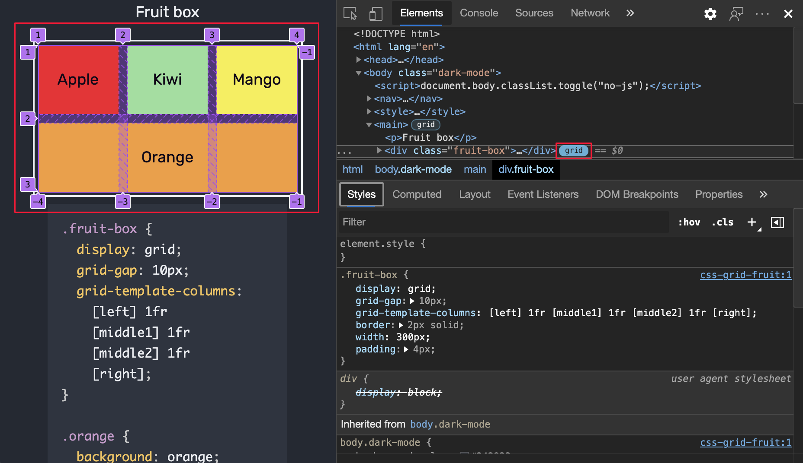
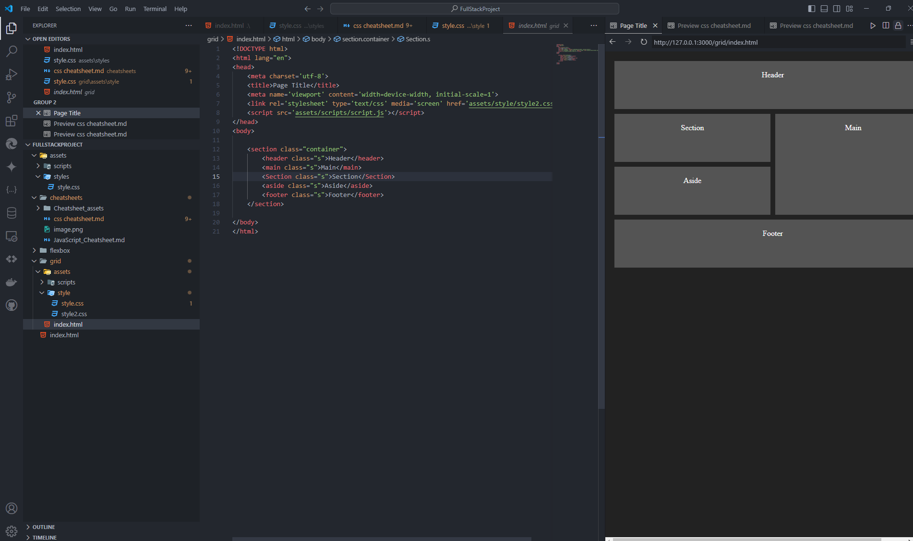
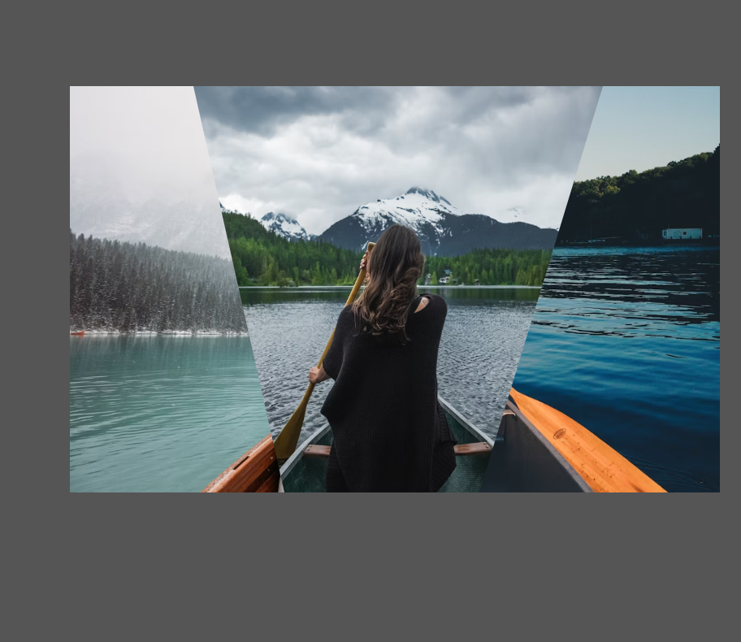

# **`CSS CHEAT SHEET`**

---

Let's dive into CSS step by step, ensuring that you thoroughly recap and remember the key concepts. We’ll start with selectors and their types, then move on to properties applicable to various elements like text, divs, paragraphs, and images. After that, we’ll explore layout techniques like flexbox and grid, followed by sizing units and animations. This will be a comprehensive recap, so let’s take it one piece at a time.

### **1. CSS Selectors: The Foundation**

CSS selectors are patterns used to select elements on a webpage so you can style them. Here’s a breakdown of the essential types:

#### **Basic Selectors**

1. **Universal Selector (`*`)**
   - Selects all elements on the page.
   ```css
   * {
       margin: 0;
       padding: 0;
   }
   ```

2. **Type Selector**
   - Selects elements by their type (e.g., `p`, `div`, `h1`).
   ```css
   p {
       font-size: 16px;
   }
   ```

3. **Class Selector (`.classname`)**
   - Selects elements with a specific class attribute.
   ```css
   .highlight {
       background-color: yellow;
   }
   ```

4. **ID Selector (`#idname`)**
   - Selects a single element with a specific ID.
   ```css
   #main-title {
       color: blue;
   }
   ```

5. **Attribute Selector**
   - Selects elements based on an attribute or attribute value.
   ```css
   input[type="text"] {
       border: 1px solid black;
   }
   ```

#### **Combinators**

1. **Descendant Selector (` `)**
   - Selects elements that are descendants of a specified element.
   ```css
   div p {
       color: red;
   }
   ```

2. **Child Selector (`>`)**
   - Selects elements that are direct children of a specified element.
   ```css
   ul > li {
       list-style-type: none;
   }
   ```

3. **Adjacent Sibling Selector (`+`)**
   - Selects an element that is immediately following another element.
   ```css
   h2 + p {
       margin-top: 0;
   }
   ```

4. **General Sibling Selector (`~`)**
   - Selects all elements that are siblings of a specified element.
   ```css
   h2 ~ p {
       color: green;
   }
   ```

#### **Pseudo-classes**

1. **`:hover`**
   - Applies styles when the mouse is over an element.
   ```css
   a:hover {
       text-decoration: underline;
   }
   ```

2. **`:first-child`**
   - Selects the first child of an element.
   ```css
   p:first-child {
       font-weight: bold;
   }
   ```

3. **`:last-child`**
   - Selects the last child of an element.
   ```css
   p:last-child {
       margin-bottom: 0;
   }
   ```

4. **`:nth-child(n)`**
   - Selects the nth child of an element.
   ```css
   li:nth-child(2) {
       color: blue;
   }
   ```

#### **Pseudo-elements**

1. **`::before`**
   - Inserts content before an element’s content.
   ```css
   p::before {
       content: "Note: ";
       font-weight: bold;
   }
   ```

2. **`::after`**
   - Inserts content after an element’s content.
   ```css
   p::after {
       content: " End of section.";
   }
   ```

### **2. Text Styling: Making Your Content Stand Out**

Text styling is a fundamental part of CSS. Here’s a recap of the most commonly used properties:

#### **Font Properties**

1. **`font-family`**
   - Defines the font of the text. It can include multiple fonts as a fallback system.
   ```css
   body {
       font-family: Arial, sans-serif;
   }
   ```

2. **`font-size`**
   - Sets the size of the font. Common units include `px`, `em`, `rem`, `%`.
   ```css
   h1 {
       font-size: 2em;
   }
   ```

3. **`font-weight`**
   - Adjusts the boldness of the text.
   ```css
   strong {
       font-weight: bold;
   }
   ```

4. **`font-style`**
   - Sets the style of the font, such as `normal`, `italic`, or `oblique`.
   ```css
   em {
       font-style: italic;
   }
   ```

5. **`font-variant`**
   - Controls the use of small caps, such as `normal` or `small-caps`.
   ```css
   p {
       font-variant: small-caps;
   }
   ```

#### **Text Properties**

1. **`color`**
   - Defines the color of the text.
   ```css
   p {
       color: #333;
   }
   ```

2. **`text-align`**
   - Aligns the text horizontally (left, right, center, justify).
   ```css
   h1 {
       text-align: center;
   }
   ```

3. **`text-decoration`**
   - Adds decoration to text, like `underline`, `overline`, `line-through`, or `none`.
   ```css
   a {
       text-decoration: none;
   }
   ```

4. **`text-transform`**
   - Controls the capitalization of text (e.g., `uppercase`, `lowercase`, `capitalize`).
   ```css
   p {
       text-transform: capitalize;
   }
   ```

5. **`letter-spacing`**
   - Adjusts the spacing between characters.
   ```css
   h2 {
       letter-spacing: 2px;
   }
   ```

6. **`line-height`**
   - Sets the space between lines of text.
   ```css
   p {
       line-height: 1.5;
   }
   ```

7. **`text-indent`**
   - Indents the first line of a paragraph.
   ```css
   p {
       text-indent: 50px;
   }
   ```

8. **`word-spacing`**
   - Adjusts the spacing between words.
   ```css
   p {
       word-spacing: 5px;
   }
   ```

9. **`white-space`**
   - Controls how white space inside an element is handled. Common values are `normal`, `nowrap`, `pre`.
   ```css
   pre {
       white-space: pre;
   }
   ```

10. **`text-shadow`**
    - Adds a shadow to the text.
    ```css
    h1 {
        text-shadow: 2px 2px 5px gray;
    }
    ```

<details>
<summary>More Details</summary>

In the `text-shadow` property:

```css
h1 {
    text-shadow: 2px 2px 5px gray;
}
```
The `px` values represent the following:

1. **2px (first value):** The horizontal offset of the shadow. It moves the shadow 2 pixels to the right. If this value were negative, the shadow would move to the left.

2. **2px (second value):** The vertical offset of the shadow. It moves the shadow 2 pixels down. If this value were negative, the shadow would move up.

3. **5px (third value):** The blur radius of the shadow. This determines how blurred the shadow will be. A higher value makes the shadow more spread out and softer. If the blur radius is 0, the shadow will be sharp.

4. **gray (fourth value):** The color of the shadow.

So in this case, the text shadow will be gray, offset 2 pixels to the right and 2 pixels down, with a blur radius of 5 pixels.

The `text-shadow` property in CSS does not directly allow you to adjust "depth" in the sense of creating a true 3D effect. However, you can create the illusion of depth by playing with the offsets, blur radius, and color.

Here are a few techniques you can use:

### 1. **Increasing Blur for Softer Shadows:**
   A larger blur radius can make the shadow appear softer and more diffused, which can give the illusion that the text is farther from the shadow, simulating depth.

   ```css
   h1 {
       text-shadow: 4px 4px 10px rgba(0, 0, 0, 0.5);
   }
   ```

   In this example, a larger blur radius (`10px`) and a partially transparent shadow color (`rgba(0, 0, 0, 0.5)`) can make the text appear like it's hovering above the shadow.

### 2. **Multiple Shadows for a 3D Effect:**
   You can stack multiple `text-shadow` values to create a more complex shadow that simulates depth.

   ```css
   h1 {
       text-shadow: 1px 1px 2px gray,
                    2px 2px 4px darkgray,
                    3px 3px 6px black;
   }
   ```

   Here, three different shadows are applied with increasing offsets and blur radii, creating the illusion of depth.

### 3. **Using `filter: drop-shadow`:**
   The `filter: drop-shadow` property can be used similarly to `text-shadow`, but it allows for more complex shadow effects, especially when combined with transformations.

   ```css
   h1 {
       filter: drop-shadow(2px 2px 5px gray);
   }
   ```

   While this doesn't add "depth" per se, it offers another way to style shadows, often with better rendering, especially for non-text elements.

### 4. **3D Text Effect Using `transform`:**
   For a more pronounced 3D effect, you can use the `transform` property along with multiple shadows:

   ```css
   h1 {
       text-shadow: 1px 1px 0 #000, 
                    2px 2px 0 #333, 
                    3px 3px 0 #666, 
                    4px 4px 0 #999;
       transform: translateZ(2px);
   }
   ```

   This stacks shadows with no blur, creating a layered look that mimics a 3D effect.

While these techniques can enhance the visual "depth" of text, for true 3D effects (like those you might create in graphic design software), you would typically need to use CSS 3D transformations, SVG, or WebGL, depending on the level of complexity you want.
</details>


### **3. Styling Block Elements (e.g., `div`, `p`)**

Block elements typically span the entire width of their container. Here’s how you can style them:

#### **Box Model Properties**

1. **`width` & `height`**
   - Sets the width and height of the element.
   ```css
   div {
       width: 100%;
       height: 200px;
   }
   ```

2. **`padding`**
   - Adds space inside the element, between the content and the border.
   ```css
   div {
       padding: 20px;
   }
   ```

3. **`margin`**
   - Adds space outside the element, between the border and the surrounding elements.
   ```css
   div {
       margin: 10px 0;
   }
   ```

4. **`border`**
   - Adds a border around the element.
   ```css
   div {
       border: 1px solid black;
   }
   ```

    <details>
    <summary>More Details</summary>

    The `border` property in CSS is used to set the border of an element, which is the visible outline of the element. It can be used to add a border around an element, or to change the appearance of an existing border.

    The `border` property is a shorthand property that sets the following properties:

    * `border-width`: the width of the border
    * `border-style`: the style of the border (e.g. solid, dashed, dotted)
    * `border-color`: the color of the border

    Here is an example:
    ```css
    /* Set border to 1 pixel solid black */
    border: 1px solid black;

    /* Set border to 2 pixels dashed red */
    border: 2px dashed red;

    /* Set border to 3 pixels dotted blue */
    border: 3px dotted blue;
    ```
    You can also set each of these properties individually using the following properties:

    * `border-width`
    * `border-style`
    * `border-color`

    For example:
    ```css
    border-width: 2px;
    border-style: dashed;
    border-color: red;
    ```
    Additionally, you can set the border for each side individually using the following properties:

    * `border-top`
    * `border-right`
    * `border-bottom`
    * `border-left`

    For example:
    ```css
    border-top: 1px solid black;
    border-right: 2px dashed red;
    border-bottom: 3px dotted blue;
    border-left: 1px solid black;
    ```
    </details>


5. **`box-shadow`**
   - Adds a shadow around the element.
   ```css
   div {
       box-shadow: 2px 2px 10px rgba(0, 0, 0, 0.5);
   }
   ```


    <details>
    <summary>More Details</summary>

    The `box-shadow` property in CSS is used to add a shadow effect to an element. It can be used to create a variety of effects, such as a drop shadow, a glow, or a 3D-like effect.

    The `box-shadow` property takes up to five values:

    * `horizontal offset`: the distance to the right (positive value) or left (negative value) of the shadow
    * `vertical offset`: the distance below (positive value) or above (negative value) of the shadow
    * `blur radius`: the amount of blur applied to the shadow
    * `spread radius`: the amount of spread applied to the shadow
    * `color`: the color of the shadow

    Here is an example:
    ```css
    /* Add a drop shadow with a horizontal offset of 5px, vertical offset of 10px, blur radius of 10px, and color of #ccc */
    box-shadow: 5px 10px 10px #ccc;

    /* Add a glow effect with a horizontal offset of 0px, vertical offset of 0px, blur radius of 20px, and color of #fff */
    box-shadow: 0px 0px 20px #fff;

    /* Add a 3D-like effect with a horizontal offset of 10px, vertical offset of 20px, blur radius of 30px, and color of #666 */
    box-shadow: 10px 20px 30px #666;
    ```
    You can also use the `inset` keyword to create an inner shadow, which is a shadow that is cast inside the element instead of outside.
    ```css
    /* Add an inner shadow with a horizontal offset of 5px, vertical offset of 10px, blur radius of 10px, and color of #ccc */
    box-shadow: inset 5px 10px 10px #ccc;
    ```
    Note that you can also use multiple `box-shadow` properties to create multiple shadows.
    ```css
    /* Add two shadows: a drop shadow and a glow effect */
    box-shadow: 5px 10px 10px #ccc, 0px 0px 20px #fff;
    ```
    </details>


6. **`overflow`**
   - Controls how content is handled when it overflows the element’s box. Common values are `visible`, `hidden`, `scroll`, `auto`.
   ```css
   div {
       overflow: auto;
   }
   ```

#### **Positioning Properties**




```css
.button {
    background-color: #414141; /* Background color */
    color: #fff; /* Text color */
    border: 1px solid #414141; /* Border style */
    border-radius: 5px; /* Rounded corners */
    padding: 10px; /* Padding inside the element */
    margin: 2.5em auto; /* Margin outside the element */
    width: 180px; /* Width of the button */
    height: 40px; /* Height of the button */
    font-family: 'Segoe UI', Tahoma, Geneva, Verdana, sans-serif; /* Font family */
    font-size: 1.5em; /* Font size */
    text-align: center; /* Center align text */
    display: flex; /* Flexbox layout */
    justify-content: center; /* Center items horizontally */
    align-items: center; /* Center items vertically */

    /* Box shadow (x-offset, y-offset, blur radius, color) */
    box-shadow: 5px 5px 10px #2c2c2c;
}
```


1. **`position`**
   - Sets how an element is positioned on the page (e.g., `static`, `relative`, `absolute`, `fixed`, `sticky`).
   ```css
   div {
       position: relative;
       top: 10px;
       left: 20px;
   }
   ```

    <details>
    <summary>More Details</summary>

    The `position` property in CSS is used to specify the positioning scheme of an element. It can be used to control the layout of an element, and to position it relative to its parent element or other elements.

    The `position` property can take one of the following values:

    * `static`: The element is positioned according to the normal flow of the document. This is the default value.
    * `relative`: The element is positioned relative to its parent element. It can be offset from its normal position using the `top`, `right`, `bottom`, and `left` properties.
    * `absolute`: The element is positioned absolutely, relative to its nearest positioned ancestor (instead of the parent element). It can be offset from its normal position using the `top`, `right`, `bottom`, and `left` properties.
    * `fixed`: The element is positioned fixed, relative to the viewport (instead of the parent element). It can be offset from its normal position using the `top`, `right`, `bottom`, and `left` properties.
    * `sticky`: The element is positioned sticky, which means it is positioned relative to its nearest positioned ancestor, but it can also be offset from its normal position using the `top`, `right`, `bottom`, and `left` properties.

    Here is an example:
    ```css
    /* Position an element relative to its parent element */
    position: relative;
    top: 20px;
    left: 30px;

    /* Position an element absolutely, relative to its nearest positioned ancestor */
    position: absolute;
    top: 20px;
    left: 30px;

    /* Position an element fixed, relative to the viewport */
    position: fixed;
    top: 20px;
    left: 30px;

    /* Position an element sticky, relative to its nearest positioned ancestor */
    position: sticky;
    top: 20px;
    left: 30px;
    ```
    Note that when using `position: absolute` or `position: fixed`, the element is removed from the normal flow of the document, and does not take up space in the layout.

    Also, when using `position: relative`, the element is still part of the normal flow of the document, but it can be offset from its normal position using the `top`, `right`, `bottom`, and `left` properties.


    When using `position: absolute` and `position: relative` together in parent and child elements, it can be a powerful way to create complex layouts.

    Here's an example:
    ```css
    .parent {
    position: relative;
    width: 400px;
    height: 200px;
    background-color: #f0f0f0;
    }

    .child {
    position: absolute;
    top: 20px;
    left: 30px;
    width: 200px;
    height: 100px;
    background-color: #ccc;
    }
    ```
    In this example, the `.parent` element has `position: relative`, which means it will serve as a reference point for its absolutely positioned child elements.

    The `.child` element has `position: absolute`, which means it will be removed from the normal flow of the document and positioned relative to its nearest positioned ancestor (in this case, the `.parent` element).

    The `top` and `left` properties of the `.child` element are used to offset it from its normal position within the `.parent` element. In this case, the `.child` element will be positioned 20px from the top and 30px from the left of the `.parent` element.

    Here's an example of how this would look:
    ```html
    <div class="parent">
    <div class="child">Child element</div>
    </div>
    ```
    This would result in the following layout:

    * The `.parent` element would take up a width of 400px and a height of 200px, with a light gray background color.
    * The `.child` element would be positioned 20px from the top and 30px from the left of the `.parent` element, with a width of 200px and a height of 100px, and a medium gray background color.

    By using `position: relative` on the parent element and `position: absolute` on the child element, we can create a layout where the child element is positioned relative to its parent, but still maintains its own size and position.

    This technique is commonly used in web development to create complex layouts, such as dropdown menus, tooltips, and modal windows.


    You're right that `position: relative` is used to position an element relative to its parent element. However, in the case where the parent element doesn't have a parent (i.e., it's the root element or the `body` element), `position: relative` might seem unnecessary.

    But here's the thing: when you set `position: relative` on an element, you're not just positioning it relative to its parent element. You're also creating a new coordinate system for that element.

    Think of it like a container that can hold other elements. When you set `position: relative` on an element, you're creating a new origin point (0, 0) for that element, which can be used as a reference point for its child elements.

    In the case of an absolutely positioned child element, it will use the nearest positioned ancestor (i.e., the element with `position: relative`) as its reference point. If the parent element doesn't have `position: relative`, the absolutely positioned child element will use the next nearest positioned ancestor, which could be the `body` element or even the `html` element.

    By setting `position: relative` on the parent element, you're creating a new coordinate system that's specific to that element and its child elements. This allows you to position the child elements relative to the parent element, rather than relative to the `body` element or some other ancestor.

    So, even if the parent element doesn't have a parent, setting `position: relative` on it still provides a useful coordinate system for its child elements.

    Here's an example to illustrate this:
    ```html
    <div class="parent">
    <div class="child">Child element</div>
    </div>
    ```
    If we set `position: absolute` on the `.child` element, but don't set `position: relative` on the `.parent` element, the `.child` element will be positioned relative to the `body` element:
    ```css
    .parent {
    width: 400px;
    height: 200px;
    }

    .child {
    position: absolute;
    top: 20px;
    left: 30px;
    }
    ```
    In this case, the `.child` element will be positioned 20px from the top and 30px from the left of the `body` element, not the `.parent` element.

    But if we set `position: relative` on the `.parent` element, the `.child` element will be positioned relative to the `.parent` element:
    ```css
    .parent {
    position: relative;
    width: 400px;
    height: 200px;
    }

    .child {
    position: absolute;
    top: 20px;
    left: 30px;
    }
    ```
    In this case, the `.child` element will be positioned 20px from the top and 30px from the left of the `.parent` element, which is what we want.


    Coordinate systems in CSS can be a bit confusing at first, but I'll try to break it down in a way that's easy to understand.

    **What is a coordinate system?**

    In CSS, a coordinate system is a way to define the position of an element on a 2D plane. It's like a grid that helps you place elements on a web page.

    **Types of coordinate systems**

    There are two main types of coordinate systems in CSS:

    1. **Absolute Coordinate System**: This is the default coordinate system used by the browser. It's based on the top-left corner of the `html` element (or the `body` element, depending on the browser). The origin point (0, 0) is at the top-left corner of the `html` element.
    2. **Relative Coordinate System**: This is a coordinate system that's relative to a specific element, rather than the `html` element. When you set `position: relative` on an element, you create a new coordinate system that's specific to that element.

    **How coordinate systems work**

    When you position an element using `top`, `right`, `bottom`, or `left` properties, you're using a coordinate system to define its position.

    * **Absolute positioning**: When you use `position: absolute`, you're positioning an element relative to the nearest positioned ancestor (i.e., an element with `position: relative`). The coordinate system used is the one defined by the nearest positioned ancestor.
    * **Relative positioning**: When you use `position: relative`, you're positioning an element relative to its normal position in the document flow. The coordinate system used is the one defined by the element itself.

    **Visualizing coordinate systems**

    Imagine a web page as a big piece of paper. The `html` element is like the top-left corner of the paper. When you position an element using `position: absolute`, you're moving it relative to the top-left corner of the paper.

    Now, imagine a smaller piece of paper (an element with `position: relative`) inside the bigger piece of paper. When you position an element inside this smaller piece of paper using `position: absolute`, you're moving it relative to the top-left corner of the smaller piece of paper, not the bigger piece of paper.

    **Example**

    Let's say you have the following HTML structure:
    ```html
    <div class="container">
    <div class="inner-container">
        <div class="box">Box</div>
    </div>
    </div>
    ```
    And the following CSS:
    ```css
    .container {
    position: relative;
    width: 400px;
    height: 200px;
    }

    .inner-container {
    position: relative;
    width: 200px;
    height: 100px;
    top: 50px;
    left: 50px;
    }

    .box {
    position: absolute;
    top: 20px;
    left: 30px;
    }
    ```
    In this example, the `.box` element is positioned relative to the `.inner-container` element, which is positioned relative to the `.container` element. The coordinate system used by the `.box` element is the one defined by the `.inner-container` element.

    I hope this explanation helps clarify how coordinate systems work in CSS!
    </details>

2. **`z-index`**
   - Controls the stacking order of elements. Higher values appear in front of lower values.
   ```css
   div {
       z-index: 10;
   }
   ```

3. **`float`**
   - Allows elements to float to the left or right, with text wrapping around them.
   ```css
   img {
       float: left;
       margin-right: 10px;
   }
   ```

4. **`clear`**
   - Clears floats, ensuring no elements float next to an element.
   ```css
   div {
       clear: both;
   }
   ```

We’ve covered the foundational CSS concepts so far. Next, we’ll explore CSS for images, animations, advanced layout techniques like flexbox and grid,

 and how to work with sizing units like `em`, `rem`, and `px`.

Let me know if you want to dive into a specific topic next, or I can continue with the recap!


Great! Let’s continue with the recap, moving on to styling images, understanding sizing units, and then exploring animations. After that, we’ll dive into layout techniques like flexbox and grid.

### **4. Styling Images**

Images are an essential part of web design, and CSS provides a variety of ways to style them effectively.

#### **Image Properties**

1. **`width` & `height`**
   - Sets the width and height of the image. You can use percentages, pixels (`px`), or other units like `em` or `rem`.
   ```css
   img {
       width: 100%;
       height: auto;
   }
   ```

2. **`border-radius`**
   - Rounds the corners of the image. You can create circular images by setting `border-radius` to `50%`.
   ```css
   img {
       border-radius: 10px;
   }
   ```

3. **`box-shadow`**
   - Adds a shadow around the image.
   ```css
   img {
       box-shadow: 5px 5px 15px rgba(0, 0, 0, 0.5);
   }
   ```
    <details>
    <summary>More Details</summary>
    


    Drop shadows are a popular visual effect used to add depth and dimension to elements on a web page. They are created by adding a shadow to an element, which gives the impression that the element is raised above the surrounding surface.

    **Creating a Drop Shadow**

    To create a drop shadow, you can use the `box-shadow` property in CSS. The syntax for `box-shadow` is as follows:
    ```css
    box-shadow: offset-x offset-y blur-radius spread-radius color;
    ```
    Here's a breakdown of the values:

    * `offset-x`: The horizontal distance of the shadow from the element.
    * `offset-y`: The vertical distance of the shadow from the element.
    * `blur-radius`: The amount of blur applied to the shadow.
    * `spread-radius`: The amount of spread applied to the shadow.
    * `color`: The color of the shadow.

    **Example**

    Here's an example of how to create a basic drop shadow:
    ```css
    div {
    box-shadow: 10px 10px 10px #ccc;
    }
    ```
    This will create a drop shadow with a horizontal offset of 10px, a vertical offset of 10px, a blur radius of 10px, and a color of #ccc.

    **Multiple Shadows**

    You can also create multiple shadows by separating the values with a comma. For example:
    ```css
    div {
    box-shadow: 10px 10px 10px #ccc, -10px -10px 10px #aaa;
    }
    ```
    This will create two drop shadows, one with a horizontal offset of 10px and a vertical offset of 10px, and another with a horizontal offset of -10px and a vertical offset of -10px.

    **Inset Shadows**

    You can also create inset shadows by adding the `inset` keyword to the `box-shadow` property. For example:
    ```css
    div {
    box-shadow: inset 10px 10px 10px #ccc;
    }
    ```
    This will create an inset shadow with a horizontal offset of 10px and a vertical offset of 10px.


    </details>
4. **`opacity`**
   - Sets the opacity of the image, making it transparent. The value ranges from `0` (completely transparent) to `1` (completely opaque).
   ```css
   img {
       opacity: 0.8;
   }
   ```

5. **`filter`**
   - Applies visual effects like blur, brightness, contrast, etc.
   ```css
   img {
       filter: grayscale(100%);
   }
   ```

    <details>
    <summary>More Details</summary>
    

    The `filter` property in CSS is used to apply visual effects to an image. It can be used to change the appearance of an image by applying a variety of effects, such as blurring, sharpening, or changing the color tone.

    **Syntax**

    The syntax for the `filter` property is as follows:
    ```css
    filter: <filter-function> [<filter-function>]* | none
    ```
    **Filter Functions**

    There are several filter functions that can be used with the `filter` property. Here are some of the most common ones:

    * `blur(radius)`: Blurs the image by the specified radius.
    * `brightness(amount)`: Adjusts the brightness of the image by the specified amount.
    * `contrast(amount)`: Adjusts the contrast of the image by the specified amount.
    * `grayscale(amount)`: Converts the image to grayscale by the specified amount.
    * `hue-rotate(angle)`: Rotates the hue of the image by the specified angle.
    * `invert(amount)`: Inverts the colors of the image by the specified amount.
    * `opacity(amount)`: Adjusts the opacity of the image by the specified amount.
    * `saturate(amount)`: Adjusts the saturation of the image by the specified amount.
    * `sepia(amount)`: Converts the image to sepia tone by the specified amount.
    * `drop-shadow(offset-x offset-y blur-radius spread-radius color)`: Adds a drop shadow to the image.

    **Example**

    Here is an example of how to use the `filter` property to apply a blur effect to an image:
    ```css
    img {
    filter: blur(5px);
    }
    ```
    This will blur the image by 5 pixels.

    You can also combine multiple filter functions to create more complex effects. For example:
    ```css
    img {
    filter: blur(5px) brightness(1.2) contrast(1.1);
    }
    ```
    This will blur the image by 5 pixels, increase the brightness by 20%, and increase the contrast by 10%.

    </details>

6. **`object-fit`**
   - Specifies how the content of a replaced element (e.g., an image) should be resized to fit its container.
   ```css
   img {
       object-fit: cover;
   }
   ```
   <details>
    <summary>More Details</summary>
    

    **Object Fit**

    The `object-fit` property is used to specify how an image or video should be scaled to fit its container. It can be used to maintain the aspect ratio of the image or video, or to stretch it to fill the container.

    **Values**

    The `object-fit` property can take the following values:

    * `fill`: The image or video is stretched to fill the container, maintaining its aspect ratio.
    * `contain`: The image or video is scaled to fit the container, maintaining its aspect ratio.
    * `cover`: The image or video is scaled to cover the entire container, maintaining its aspect ratio.
    * `none`: The image or video is not scaled, and its original size is used.
    * `scale-down`: The image or video is scaled down to fit the container, maintaining its aspect ratio.

    **Example**

    Here is an example of how to use the `object-fit` property:
    ```css
    img {
    width: 100%;
    height: 100%;
    object-fit: cover;
    }
    ```
    In this example, the image is scaled to cover the entire container, maintaining its aspect ratio.


    **Use Cases**

    The `object-fit` property can be used in a variety of scenarios, such as:

    * Scaling images to fit a container, while maintaining their aspect ratio.
    * Creating responsive images that adapt to different screen sizes.
    * Scaling videos to fit a container, while maintaining their aspect ratio.
    * Creating responsive videos that adapt to different screen sizes.

    **Best Practices**

    Here are some best practices to keep in mind when using the `object-fit` property:

    * Use the `object-fit` property in conjunction with the `width` and `height` properties to specify the size of the container.
    * Use the `contain` value to maintain the aspect ratio of the image or video.
    * Use the `cover` value to scale the image or video to cover the entire container.
    * Use the `none` value to prevent scaling of the image or video.
    * Test the `object-fit` property in different browsers and devices to ensure compatibility.
    </details>

7. **`object-position`**
   - Specifies the alignment of the image within its box when `object-fit` is used.
   ```css
   img {
       object-position: center;
   }
   ```
    <details>
    <summary>More Details</summary>
    

    **Object Position**

    The `object-position` property is used to specify the alignment of an image or video within its container. It can be used to position the image or video within the container, or to center it.

    **Syntax**

    The syntax for the `object-position` property is as follows:
    ```css
    object-position: <position> | <x-position> <y-position>;
    ```
    Here's a breakdown of the values:

    * `<position>`: A keyword or percentage value that specifies the position of the image or video within the container.
    * `<x-position>`: A keyword or percentage value that specifies the horizontal position of the image or video within the container.
    * `<y-position>`: A keyword or percentage value that specifies the vertical position of the image or video within the container.

    **Keywords**

    The `object-position` property supports the following keywords:

    * `top`: Aligns the image or video to the top of the container.
    * `bottom`: Aligns the image or video to the bottom of the container.
    * `left`: Aligns the image or video to the left of the container.
    * `right`: Aligns the image or video to the right of the container.
    * `center`: Centers the image or video within the container.

    **Percentage Values**

    You can also use percentage values to specify the position of the image or video within the container. The values range from 0% to 100%. For example:

    * `50% 50%`: Centers the image or video within the container.
    * `20% 80%`: Positions the image or video at 20% from the left and 80% from the top of the container.

    **Example**

    Here is an example of how to use the `object-position` property:
    ```css
    img {
    width: 100%;
    height: 100%;
    object-fit: cover;
    object-position: center;
    }
    ```
    In this example, the image is positioned at the center of the container.

    **Browser Support**

    The `object-position` property is supported by most modern browsers, including Chrome, Firefox, Safari, and Edge. However, the level of support may vary depending on the specific values used.

    **IE Support**

    Unfortunately, the `object-position` property is not supported by Internet Explorer (IE) versions 8 and earlier. However, you can use the `background-position` property in IE 9 and later versions to achieve a similar effect. For example:
    ```css
    div {
    background-image: url('image.jpg');
    background-size: cover;
    background-position: center;
    }
    ```
    This will position the background image at the center of the container.

    **Use Cases**

    The `object-position` property can be used in a variety of scenarios, such as:

    * Positioning images or videos within a container.
    * Centering images or videos within a container.
    * Aligning images or videos to specific positions within a container.

    **Best Practices**

    Here are some best practices to keep in mind when using the `object-position` property:

    * Use the `object-position` property in conjunction with the `object-fit` property to specify the size and position of the image or video within the container.
    * Use keywords or percentage values to specify the position of the image or video within the container.
    * Test the `object-position` property in different browsers and devices to ensure compatibility.

    </details>


8.  **`Background Images`**

    Background images are a fundamental aspect of web design, allowing you to add visual interest and depth to your web pages. Here's a comprehensive overview of background images:

    **Types of Background Images**

    There are several types of background images you can use:

    1. **Static images**: These are regular images that are displayed as the background of an element.
    2. **Gradient images**: These are images that transition from one color to another, often used to create a subtle background effect.
    3. **Pattern images**: These are images that repeat to create a pattern, often used to add texture or interest to a background.
    4. **Animated images**: These are images that change or move over time, often used to create a dynamic background effect.

    **Background Image Properties**

    Here are some key properties you can use to control background images:

    1. **`background-image`**: Specifies the URL of the background image.
    2. **`background-size`**: Specifies the size of the background image.
    3. **`background-position`**: Specifies the position of the background image.
    4. **`background-repeat`**: Specifies whether the background image should repeat or not.
    5. **`background-attachment`**: Specifies whether the background image should scroll with the content or remain fixed.

    **Background Image Syntax**

    Here's an example of how to use background images:
    ```css
    .element {
    background-image: url('image.jpg');
    background-size: cover;
    background-position: center;
    background-repeat: no-repeat;
    background-attachment: fixed;
    }
    ```
    <details>
    <summary>More Details</summary>
    


    **Background Size**

    The `background-size` property is used to specify the size of the background image. It can be used to scale the image to a specific size, or to cover the entire element.

    **Syntax**

    The syntax for the `background-size` property is as follows:
    ```css
    background-size: <size> | <width> <height>;
    ```
    Here's a breakdown of the values:

    * `<size>`: A keyword or length value that specifies the size of the background image.
    * `<width>`: A length value that specifies the width of the background image.
    * `<height>`: A length value that specifies the height of the background image.

    **Keywords**

    The `background-size` property supports the following keywords:

    * `auto`: The background image is displayed at its original size.
    * `cover`: The background image is scaled to cover the entire element, while maintaining its aspect ratio.
    * `contain`: The background image is scaled to fit within the element, while maintaining its aspect ratio.
    * `100% 100%`: The background image is scaled to 100% of the element's width and height.

    **Length Values**

    You can also use length values to specify the size of the background image. For example:

    * `200px 300px`: The background image is scaled to 200px wide and 300px tall.
    * `50% 75%`: The background image is scaled to 50% of the element's width and 75% of its height.

    **Multiple Values**

    You can also use multiple values to specify the size of multiple background images. For example:
    ```css
    background-size: 200px 300px, 50% 75%;
    ```
    This sets the size of the first background image to 200px wide and 300px tall, and the size of the second background image to 50% of the element's width and 75% of its height.

    **Browser Support**

    The `background-size` property is widely supported by most modern browsers, including Chrome, Firefox, Safari, and Edge. However, the level of support may vary depending on the specific values used.

    **Best Practices**

    Here are some best practices to keep in mind when using the `background-size` property:

    * Use the `cover` or `contain` keywords to scale the background image while maintaining its aspect ratio.
    * Use length values to specify the size of the background image in pixels or percentages.
    * Avoid using the `auto` keyword, as it can cause the background image to be displayed at its original size, which may not be desirable.
    * Test the `background-size` property in different browsers and devices to ensure compatibility.

    **Examples**

    Here are some examples of how to use the `background-size` property:
    ```css
    .element {
    background-image: url('image.jpg');
    background-size: cover;
    }

    .element {
    background-image: url('image.jpg');
    background-size: 200px 300px;
    }

    .element {
    background-image: url('image.jpg');
    background-size: 50% 75%;
    }
    ```
    These examples demonstrate how to use the `background-size` property to scale a background image to cover the entire element, to a specific size, or to a percentage of the element's width and height.

    

    **Background Position**

    The `background-position` property is used to specify the position of the background image. It can be used to position the image at a specific point within the element, or to center it.

    **Syntax**

    The syntax for the `background-position` property is as follows:
    ```css
    background-position: <position> | <x> <y>;
    ```
    Here's a breakdown of the values:

    * `<position>`: A keyword or length value that specifies the position of the background image.
    * `<x>`: A length value that specifies the x-coordinate of the background image.
    * `<y>`: A length value that specifies the y-coordinate of the background image.

    **Keywords**

    The `background-position` property supports the following keywords:

    * `center`: The background image is centered within the element.
    * `top`: The background image is positioned at the top of the element.
    * `bottom`: The background image is positioned at the bottom of the element.
    * `left`: The background image is positioned at the left of the element.
    * `right`: The background image is positioned at the right of the element.

    **Length Values**

    You can also use length values to specify the position of the background image. For example:

    * `20px 30px`: The background image is positioned 20px from the left and 30px from the top of the element.
    * `50% 75%`: The background image is positioned 50% from the left and 75% from the top of the element.

    **Multiple Values**

    You can also use multiple values to specify the position of multiple background images. For example:
    ```css
    background-position: center, 20px 30px;
    ```
    This sets the position of the first background image to the center of the element, and the position of the second background image to 20px from the left and 30px from the top of the element.


    **Background Repeat**

    The `background-repeat` property is used to specify whether the background image should repeat or not. It can be used to repeat the image horizontally, vertically, or both.

    **Syntax**

    The syntax for the `background-repeat` property is as follows:
    ```css
    background-repeat: <repeat> | <x> <y>;
    ```
    Here's a breakdown of the values:

    * `<repeat>`: A keyword that specifies whether the background image should repeat or not.
    * `<x>`: A keyword that specifies whether the background image should repeat horizontally or not.
    * `<y>`: A keyword that specifies whether the background image should repeat vertically or not.

    **Keywords**

    The `background-repeat` property supports the following keywords:

    * `repeat`: The background image repeats both horizontally and vertically.
    * `no-repeat`: The background image does not repeat.
    * `repeat-x`: The background image repeats horizontally.
    * `repeat-y`: The background image repeats vertically.

    **Multiple Values**

    You can also use multiple values to specify the repeat behavior of multiple background images. For example:
    ```css
    background-repeat: repeat, no-repeat;
    ```
    This sets the repeat behavior of the first background image to repeat both horizontally and vertically, and the repeat behavior of the second background image to not repeat.


    **Background Attachment**

    The `background-attachment` property is used to specify whether the background image should scroll with the content or not. It can be used to fix the background image in place, or to allow it to scroll with the content.

    **Syntax**

    The syntax for the `background-attachment` property is as follows:
    ```css
    background-attachment: <attachment>;
    ```
    Here's a breakdown of the values:

    * `<attachment>`: A keyword that specifies whether the background image should scroll with the content or not.

    **Keywords**

    The `background-attachment` property supports the following keywords:

    * `scroll`: The background image scrolls with the content.
    * `fixed`: The background image does not scroll with the content.

    **Multiple Values**

    You can also use multiple values to specify the attachment behavior of multiple background images. For example:
    ```css
    background-attachment: scroll, fixed;
    ```
    This sets the attachment behavior of the first background image to scroll with the content, and the attachment behavior of the second background image to not scroll with the content.

    I hope this helps! Let me know if you have any questions or need further clarification.

    **Background Image Shortcuts**

    You can also use background image shortcuts to simplify your code:
    ```css
    .element {
    background: url('image.jpg') no-repeat center fixed;
    }
    ```
    **Multiple Background Images**

    You can also use multiple background images by separating them with commas:
    ```css
    .element {
    background-image: url('image1.jpg'), url('image2.jpg');
    background-position: center, top left;
    background-repeat: no-repeat, repeat;
    }
    ```
    **Background Image Gradients**

    You can also use background image gradients to create a gradient effect:
    ```css
    .element {
    background-image: linear-gradient(to bottom, #fff, #000);
    }
    ```
    **Browser Support**

    Background images are widely supported by most modern browsers, including Chrome, Firefox, Safari, and Edge. However, the level of support may vary depending on the specific properties used.

    **Best Practices**

    Here are some best practices to keep in mind when using background images:

    * Use high-quality images that are optimized for web use.
    * Use background images that are relevant to the content and enhance the user experience.
    * Avoid using background images that are too large or too small, as this can affect page load times.
    * Use background image properties to control the size, position, and repeat of the image.
    * Test background images in different browsers and devices to ensure compatibility.
    </details>

9. **`Gradients`**

    A gradient is a transition between two or more colors, used to create a visually appealing effect. In CSS, you can create gradients using the `linear-gradient()` or `radial-gradient()` functions.

    <details>
    <summary>More Details</summary>
    
    **Linear Gradient**

    A linear gradient is a gradient that transitions between colors in a linear direction. You can create a linear gradient using the `linear-gradient()` function, which takes the following syntax:
    ```css
    linear-gradient(direction, color1, color2, ...);
    ```
    Here's a breakdown of the values:

    * `direction`: The direction of the gradient, specified as an angle (e.g. `45deg`) or a keyword (e.g. `to bottom`).
    * `color1`, `color2`, etc.: The colors of the gradient, specified as hex codes, RGB values, or color names.

    Example:
    ```css
    background-image: linear-gradient(to bottom, #f00, #0f0);
    ```
    This creates a linear gradient that transitions from red to green, from top to bottom.

    **Radial Gradient**

    A radial gradient is a gradient that transitions between colors in a radial direction. You can create a radial gradient using the `radial-gradient()` function, which takes the following syntax:
    ```css
    radial-gradient(shape, size, color1, color2, ...);
    ```
    Here's a breakdown of the values:

    * `shape`: The shape of the gradient, specified as a keyword (e.g. `circle`) or a value (e.g. `ellipse`).
    * `size`: The size of the gradient, specified as a value (e.g. `50%`) or a keyword (e.g. `farthest-corner`).
    * `color1`, `color2`, etc.: The colors of the gradient, specified as hex codes, RGB values, or color names.

    Example:
    ```css
    background-image: radial-gradient(circle, #f00, #0f0);
    ```
    This creates a radial gradient that transitions from red to green, in a circular shape.

    **Combining Gradients with Background Images**

    You can combine gradients with background images using the `background-image` property. For example:
    ```css
    background-image: linear-gradient(to bottom, #f00, #0f0), url(image.jpg);
    ```
    This creates a linear gradient that transitions from red to green, and overlays it on top of the background image.

    **Combining Gradients with Background Colors**

    You can combine gradients with background colors using the `background` property. For example:
    ```css
    background: linear-gradient(to bottom, #f00, #0f0), #fff;
    ```
    This creates a linear gradient that transitions from red to green, and sets the background color to white.

    **Multiple Gradients**

    You can create multiple gradients by separating them with commas. For example:
    ```css
    background-image: linear-gradient(to bottom, #f00, #0f0), linear-gradient(to top, #0f0, #f00);
    ```
    This creates two linear gradients that transition in opposite directions.

    **Gradient Transparency**

    You can create transparent gradients by using the `rgba()` function to specify the color values. For example:
    ```css
    background-image: linear-gradient(to bottom, rgba(255, 0, 0, 0.5), rgba(0, 255, 0, 0.5));
    ```
    This creates a linear gradient that transitions from a semi-transparent red to a semi-transparent green.

    I hope this helps! Let me know if you have any questions or need further clarification.


    **Gradient Keywords**

    In CSS, you can use keywords to specify the direction, shape, and size of gradients. Here are some common keywords:

    **Direction Keywords**

    * `to top`: Gradient direction is from bottom to top.
    * `to bottom`: Gradient direction is from top to bottom.
    * `to left`: Gradient direction is from right to left.
    * `to right`: Gradient direction is from left to right.
    * `to top left`: Gradient direction is from bottom right to top left.
    * `to top right`: Gradient direction is from bottom left to top right.
    * `to bottom left`: Gradient direction is from top right to bottom left.
    * `to bottom right`: Gradient direction is from top left to bottom right.

    **Shape Keywords**

    * `circle`: Gradient shape is a circle.
    * `ellipse`: Gradient shape is an ellipse.

    **Size Keywords**

    * `closest-side`: Gradient size is the distance from the center of the gradient to the closest side of the element.
    * `closest-corner`: Gradient size is the distance from the center of the gradient to the closest corner of the element.
    * `farthest-side`: Gradient size is the distance from the center of the gradient to the farthest side of the element.
    * `farthest-corner`: Gradient size is the distance from the center of the gradient to the farthest corner of the element.

    **Example**
    ```css
    background-image: linear-gradient(to bottom, #f00, #0f0);
    ```
    In this example, the `to bottom` keyword specifies the direction of the gradient.

    **Angle Values**

    You can also specify the direction of the gradient using an angle value. For example:
    ```css
    background-image: linear-gradient(45deg, #f00, #0f0);
    ```
    In this example, the `45deg` value specifies the direction of the gradient as 45 degrees from the horizontal axis.

    I hope this helps! Let me know if you have any questions or need further clarification..
    </details>


### **5. Sizing Units: `px`, `em`, `rem`, and Others**

Understanding CSS units is crucial for responsive design. Here’s a breakdown:

#### **Absolute Units**

1. **`px` (Pixels)**
   - The most common unit. It’s an absolute unit, meaning it doesn’t scale with user preferences. It’s fixed to the display device.
   ```css
   p {
       font-size: 16px;
   }
   ```

2. **`pt` (Points)**
   - Used mainly in print stylesheets, `pt` is another absolute unit commonly used in typography.
   ```css
   p {
       font-size: 12pt;
   }
   ```

#### **Relative Units**

1. **`em`**
   - Relative to the font-size of the element’s parent. `1em` is equal to the font size of the element itself. This makes `em` unit scalable.
   ```css
   p {
       font-size: 1.5em; /* 1.5 times the size of the parent element’s font-size */
   }
   ```

2. **`rem` (Root em)**
   - Similar to `em`, but `rem` is relative to the root element (`<html>`). This ensures consistency across your layout, especially for responsive designs.
   ```css
   p {
       font-size: 1.5rem; /* 1.5 times the size of the root element’s font-size */
   }
   ```

3. **`%` (Percentage)**
   - Often used for widths and heights, `%` is relative to the parent element’s dimensions.
   ```css
   div {
       width: 50%; /* 50% of the parent element’s width */
   }
   ```

4. **`vh` and `vw` (Viewport Height and Width)**
   - `1vh` is equal to 1% of the viewport’s height; `1vw` is equal to 1% of the viewport’s width. Useful for responsive design.
   ```css
   div {
       height: 100vh; /* Full height of the viewport */
   }
   ```

5. **`min-content` and `max-content`**
   - These units can be used in layouts where you want an element to shrink to fit its content or stretch to its maximum size.
   ```css
   div {
       width: min-content;
   }
   ```

### **6. Animations: Adding Life to Your Webpages**

CSS animations allow you to animate transitions between different states of an element. Let’s break it down:

#### **Transitions**

1. **`transition`**
   - Defines the property to be transitioned, the duration, timing function, and delay.
   ```css
   div {
       transition: background-color 0.5s ease-in-out;
   }
   div:hover {
       background-color: lightblue;
   }
   ```

    <details>
    <summary>More Details</summary>
    

    Here's a comprehensive overview of CSS transitions:

    **What are CSS Transitions?**

    CSS transitions allow you to smoothly animate the changes between two states of an element. Unlike animations, which can be used to create complex animations, transitions are used to create simple animations that occur when an element's property changes.

    **Basic Syntax**

    The basic syntax for transitions is:
    ```css
    transition: property duration timing-function delay;
    ```
    Here's a breakdown of each property:

    * `property`: The CSS property that you want to transition (e.g. `opacity`, `transform`, `background-color`, etc.)
    * `duration`: The length of time the transition should take (e.g. `0.5s`, `1s`, etc.)
    * `timing-function`: The timing function that controls the speed of the transition (e.g. `linear`, `ease-in`, `ease-out`, etc.)
    * `delay`: The amount of time to wait before starting the transition (e.g. `0.5s`, `1s`, etc.)

    **Example**

    Here's an example of a simple transition:
    ```css
    .box {
    background-color: #f2f2f2;
    transition: background-color 0.5s ease-in-out;
    }

    .box:hover {
    background-color: #4CAF50;
    }
    ```
    In this example, when the user hovers over the `.box` element, the `background-color` property changes from `#f2f2f2` to `#4CAF50`. The transition takes 0.5 seconds to complete, and the timing function is set to `ease-in-out`.

    **Transition Properties**

    Here are some common transition properties:

    * `transition-property`: Specifies the CSS property that you want to transition.
    * `transition-duration`: Specifies the length of time the transition should take.
    * `transition-timing-function`: Specifies the timing function that controls the speed of the transition.
    * `transition-delay`: Specifies the amount of time to wait before starting the transition.

    **Transition Timing Functions**

    Here are some common transition timing functions:

    * `linear`: Specifies a constant speed throughout the transition.
    * `ease`: Specifies a slow start, then fast, then slow end.
    * `ease-in`: Specifies a slow start.
    * `ease-out`: Specifies a slow end.
    * `ease-in-out`: Specifies a slow start and end.
    * `cubic-bezier`: Specifies a custom timing function using cubic-bezier values.

    **Transition Examples**

    Here are some more examples of transitions:

    * **Fade in**: `transition: opacity 0.5s ease-in-out;`
    * **Slide in**: `transition: transform 0.5s ease-in-out;`
    * **Scale up**: `transition: transform 0.5s ease-in-out;`
    * **Rotate**: `transition: transform 0.5s ease-in-out;`

    **Transition Best Practices**

    Here are some best practices to keep in mind when using transitions:

    * Use transitions sparingly, as they can be distracting if overused.
    * Use a consistent timing function throughout your application.
    * Use a consistent duration throughout your application.
    * Test your transitions on different devices and browsers to ensure they work as expected.

    I hope this comprehensive overview helps you understand CSS transitions! Let me know if you have any further questions.
    </details>

#### **Keyframes**

1. **`@keyframes`**
   - Defines an animation with specific stages (keyframes) and styles at those stages.
   ```css
   @keyframes slideIn {
       from {
           transform: translateX(-100%);
           opacity: 0;
       }
       to {
           transform: translateX(0);
           opacity: 1;
       }
   }

   div {
       animation: slideIn 1s ease-in-out;
   }
   ```

2. **`animation`**
   - Applies the animation defined in `@keyframes` to an element, specifying the duration, timing function, delay, iteration count, direction, and fill mode.
   ```css
   div {
       animation: slideIn 2s ease-in-out infinite alternate;
   }
   ```

#### **Properties**

1. **`animation-duration`**
   - Specifies how long the animation takes to complete one cycle.
   ```css
   div {
       animation-duration: 2s;
   }
   ```

2. **`animation-timing-function`**
   - Defines the speed curve of the animation. Common values are `linear`, `ease`, `ease-in`, `ease-out`, and `ease-in-out`.
   ```css
   div {
       animation-timing-function: ease-in-out;
   }
   ```

3. **`animation-delay`**
   - Specifies a delay before the animation starts.
   ```css
   div {
       animation-delay: 1s;
   }
   ```

4. **`animation-iteration-count`**
   - Defines how many times the animation should repeat. It can be a number or `infinite`.
   ```css
   div {
       animation-iteration-count: infinite;
   }
   ```

5. **`animation-direction`**
   - Specifies whether the animation should play in reverse on alternate cycles.
   ```css
   div {
       animation-direction: alternate;
   }
   ```

6. **`animation-fill-mode`**
   - Specifies how a CSS animation should apply styles to its target before and after it is executing.
   ```css
   div {
       animation-fill-mode: forwards;
   }
   ```

    <details>
    <summary>More Details</summary>
    Sure! Here's a comprehensive overview of CSS animations:

        
    ```css

    .container > div {
        width: 300px;
        height: 300px;
        background-color: darkblue;
        /* Animation */
        animation-name: rotate;
        animation-duration: 4s;
        animation-iteration-count: 1;
        animation-timing-function: ease-in ;
    }

    @keyframes rotate {
        0% {
            transform:scale(2);
        }
        25% {
            transform: scale(0.2);
            background-color: teal;
            transform: skew(10deg);
        }
        50% {
            transform: skew(40deg);
            background-color: rgb(9, 177, 219);
            border-radius: 50%;
        }
        75% {
            transform: skew(10deg);
            background-color: rgb(0, 255, 200);
        }
        100% {
            background-color: black;
            transform: skew(80deg);
            transform: scale(4);
        }
    }

    ```


    ### Animation Basics

    To create a CSS animation, you need to define the animation using the `@keyframes` rule. This rule allows you to specify the intermediate styles for the animation.

    Here's an example of a simple `@keyframes` rule:

    ```css
    @keyframes slide {
    0% {
        transform: translateX(0);
    }
    100% {
        transform: translateX(100px);
    }
    }
    ```

    In this example, we define an animation called `slide` that moves an element horizontally from its original position to a position 100 pixels to the right.

    ### Applying Animations to Elements

    Once you have defined an animation using `@keyframes`, you can apply it to an element using the `animation` property.

    Here's an example of applying the `slide` animation to an element:

    ```css
    .box {
    animation: slide 2s linear infinite;
    }
    ```

    In this example, we apply the `slide` animation to an element with the class `box`. The animation will take 2 seconds to complete and will repeat indefinitely.

    ### Animation Properties

    There are several properties you can use to customize animations:

    - `animation-name`: Specifies the name of the animation to apply.
    - `animation-duration`: Specifies the duration of the animation.
    - `animation-timing-function`: Specifies the timing function of the animation.
    - `animation-delay`: Specifies the delay before the animation starts.
    - `animation-iteration-count`: Specifies the number of times the animation should repeat.
    - `animation-direction`: Specifies the direction of the animation.

    Here's an example of using some of these properties:

    ```css
    .box {
    animation: slide 2s ease-in-out infinite alternate;
    }
    ```

    In this example, we apply the `slide` animation to an element with the class `box`. The animation will take 2 seconds to complete, will have an ease-in-out timing function, will repeat indefinitely, and will alternate between the start and end states.

    ### Animation Events

    CSS animations also provide several events that you can use to control the animation:

    - `animationstart`: Fired when the animation begins.
    - `animationend`: Fired when the animation ends.
    - `animationiteration`: Fired when the animation repeats.

    Here's an example of using the `animationstart` event:

    ```css
    .box {
    animation: slide 2s linear infinite;
    }

    .box:hover {
    animation-play-state: paused;
    }
    ```

    In this example, we apply the `slide` animation to an element with the class `box`. When the element is hovered over, the animation is paused.

    ### Animation Keyframes

    The `@keyframes` rule allows you to define the intermediate styles for an animation.

    Here's an example of using keyframes to create a fade-in effect:

    ```css
    @keyframes fadeIn {
    0% {
        opacity: 0;
    }
    100% {
        opacity: 1;
    }
    }

    .box {
    animation: fadeIn 2s linear;
    }
    ```

    In this example, we define an animation called `fadeIn` that fades an element in from an opacity of 0 to an opacity of 1.

    ### Animation Timing Functions

    CSS animations also provide several timing functions that you can use to control the speed of the animation:

    - `linear`: Specifies a constant speed throughout the animation.
    - `ease`: Specifies a slow start, then fast, then slow end.
    - `ease-in`: Specifies a slow start.
    - `ease-out`: Specifies a slow end.
    - `ease-in-out`: Specifies a slow start and end.
    - `cubic-bezier`: Specifies a custom timing function using cubic-bezier values.

    Here's an example of using the `ease-in-out` timing function:

    ```css
    .box {
    animation: slide 2s ease-in-out infinite;
    }
    ```

    In this example, we apply the `slide` animation to an element with the class `box`. The animation will have a slow start and end.

    ### Animation States

    CSS animations also provide several states that you can use to control the animation:

    - `running`: Specifies that the animation is running.
    - `paused`: Specifies that the animation is paused.
    - `idle`: Specifies that the animation is idle.

    Here's an example of using the `paused` state:

    ```css
    .box {
    animation-play-state: paused;
    }

    .box:hover {
    animation-play-state: running;
    }
    ```

    In this example, we pause the animation by default. When the element is hovered over, the animation is resumed.

    I hope this comprehensive overview helps you understand CSS animations! Let me know if you have any further questions.


    **Animation Direction**

    The `animation-direction` property specifies the direction of an animation. It can have the following values:

    * `normal`: The animation plays in the normal direction, from start to finish.
    * `reverse`: The animation plays in the reverse direction, from finish to start.
    * `alternate`: The animation plays in the normal direction first, then in the reverse direction, alternating between the two.
    * `alternate-reverse`: The animation plays in the reverse direction first, then in the normal direction, alternating between the two.

    Here's an example:
    ```css
    animation: myAnimation 3s infinite;
    animation-direction: alternate;
    ```
    In this example, the animation `myAnimation` will play in the normal direction first, then in the reverse direction, alternating between the two.

    **Animation Fill Mode**

    The `animation-fill-mode` property specifies how an animation should apply styles to its target element before and after the animation is executed. It can have the following values:

    * `none`: The animation does not apply any styles to the target element before or after the animation is executed.
    * `forwards`: The animation applies the styles defined in the last keyframe to the target element after the animation is executed.
    * `backwards`: The animation applies the styles defined in the first keyframe to the target element before the animation is executed.
    * `both`: The animation applies the styles defined in the first keyframe to the target element before the animation is executed, and the styles defined in the last keyframe to the target element after the animation is executed.

    Here's an example:
    ```css
    animation: myAnimation 3s infinite;
    animation-fill-mode: forwards;
    ```
    In this example, the animation `myAnimation` will apply the styles defined in the last keyframe to the target element after the animation is executed.

    **Common Use Cases**

    Here are some common use cases for `animation-direction` and `animation-fill-mode`:

    * **Button hover effect**: Use `animation-direction: alternate` and `animation-fill-mode: both` to create a button hover effect that scales up and down.
    * **Loading animation**: Use `animation-direction: normal` and `animation-fill-mode: forwards` to create a loading animation that fills up a progress bar.
    * **Slide-in effect**: Use `animation-direction: normal` and `animation-fill-mode: forwards` to create a slide-in effect that moves an element into view.

    **Best Practices**

    Here are some best practices to keep in mind when using `animation-direction` and `animation-fill-mode`:

    * Use `animation-direction` to control the direction of your animation, and `animation-fill-mode` to control how the animation applies styles to its target element.
    * Use `animation-fill-mode: forwards` to ensure that the animation applies the styles defined in the last keyframe to the target element after the animation is executed.
    * Use `animation-fill-mode: backwards` to ensure that the animation applies the styles defined in the first keyframe to the target element before the animation is executed.

    I hope this helps you understand `animation-direction` and `animation-fill-mode`! Let me know if you have any further questions.

    </details>
    


### **7. Layout Techniques: Flexbox and Grid**

Now, let's cover the powerful layout techniques that will allow you to build responsive, flexible designs.

#### **Flexbox: Flexible Box Layout**

Flexbox is a one-dimensional layout method that allows you to distribute space and align items in a container, even when their sizes are unknown or dynamic.

1. **`display: flex`**
   - Turns the container into a flex container, making all direct children flex items.
   ```css
   .container {
       display: flex;
   }
   ```

2. **`flex-direction`**
   - Defines the direction of the flex items. Common values are `row`, `row-reverse`, `column`, and `column-reverse`.
   ```css
   .container {
       flex-direction: row;
   }
   ```

3. **`justify-content`**
   - Aligns the flex items along the main axis (horizontally for `row`, vertically for `column`). Values include `flex-start`, `flex-end`, `center`, `space-between`, `space-around`, `space-evenly`.
   ```css
   .container {
       justify-content: space-between;
   }
   ```

4. **`align-items`**
   - Aligns flex items along the cross axis (vertically for `row`, horizontally for `column`). Values include `flex-start`, `flex-end`, `center`, `baseline`, and `stretch`.
   ```css
   .container {
       align-items: center;
   }
   ```

5. **`flex-wrap`**
   - Controls whether the flex items should wrap onto multiple lines.
   ```css
   .container {
       flex-wrap: wrap;
   }
   ```

6. **`flex-grow`, `flex-shrink`, `flex-basis`**
   - `flex-grow` specifies how much a flex item will grow relative to the rest. `flex-shrink` specifies how much a flex item will shrink relative to the rest. `flex-basis` defines the default size of an element before the remaining space is distributed.
   ```css
   .item {
       flex-grow: 2;
       flex-shrink: 1;
       flex-basis: 200px;
   }
   ```

#### **CSS Grid Layout**

CSS Grid is a two-dimensional layout system for the web, allowing you to create complex layouts with rows and columns.


```css

.container{
    background-color: rgb(34, 34, 34);
    padding: 20px;
    height: 100vh;
    width: 100vw;
    display: grid;
    /* grid-template-columns: [start] 200fr 200fr 200fr [end]; */
    /* grid-template-columns: 1fr minmax(200px, 1fr) 1fr; */
    grid-template-columns: repeat(3, 100px);
    /* grid-template-columns: repeat(auto-fill, 100px); */
    /* grid-template-rows: repeat(3, 1fr); */
    grid-template-rows: repeat(auto-fit, 200px);
    grid-gap: 10px;
    /* justify-content: flex-end;
    align-items: center; */

}
```

```css
grid-template-columns: [start] 200fr 200fr 200fr [end]; 
```
Specializing two columns as start and end



Apple is in between 1st and 3rd column

```css
.apple {
    grid-column-start: 1;
    grid-column-end: 2;
    grid-row-start: 1;
    grid-row-end: 2;
/* 
    grid-row: 1/2; */
    /* grid-column-end: -2; */
}
```

0. **`Fr`**

    ```css
    .container{
        background-color: rgb(34, 34, 34);
        padding: 20px;
        height: 100vh;
        width: 100vw;
        display: grid;
        grid-template-rows: 1px repeat(3, 1fr);
        grid-template-rows: repeat(auto-fit, 200px);
        grid-gap: 10px;
        /* justify-content: flex-end;
        align-items: center; */
    }
    ```

    divides items to pixels or whatever then get the remaining part and divides it as a fraction. 2fr is 2 times the remaining part. 

1. **`display: grid`**
   - Turns the container into a grid container, allowing you to define rows and

 columns.
   ```css
   .grid-container {
       display: grid;
   }
   ```

2. **`grid-template-columns` and `grid-template-rows`**
   - Defines the structure of the grid by specifying the sizes of the columns and rows.
   ```css
   .grid-container {
       grid-template-columns: repeat(3, 1fr);
       grid-template-rows: auto;
   }
   ```

3. **`grid-gap`**
   - Sets the gap between rows and columns (also known as `gap`, `row-gap`, and `column-gap` in modern CSS).
   ```css
   .grid-container {
       grid-gap: 10px;
   }
   ```

4. **`grid-column` and `grid-row`**
   - Controls the placement of a grid item by specifying where it starts and how many tracks it spans.
   ```css
   .grid-item {
       grid-column: 2 / span 2;
       grid-row: 1 / 3;
   }
   ```

5. **`justify-items` and `align-items`**
   - Aligns the grid items within their grid areas along the horizontal (justify) and vertical (align) axes.
   ```css
   .grid-container {
       justify-items: center;
       align-items: stretch;
   }
   ```

6. **`grid-auto-rows` and `grid-auto-columns`**
   - Specifies the size of rows and columns that are created automatically.
   ```css
   .grid-container {
       grid-auto-rows: minmax(100px, auto);
   }
   ```

7. **`grid-area`**
   - Assigns a name to a grid item and uses it in the `grid-template-areas` property.
   ```css
   .grid-item {
       grid-area: header;
   }
   ```

8. **`grid-template-areas`**
   - Defines a grid template by referencing the names of grid areas, creating a visual layout.
   ```css
   .grid-container {
       grid-template-areas:
           "header header header"
           "sidebar main main"
           "footer footer footer";
   }
   ```

    

    ```css
    .container {
        background-color: rgb(34,34,34);
        padding: 20px;
        height: 100vh;
        width: 100vw;
        display: grid;
        grid-template-columns: repeat(4, minmax(100px,200px));
        grid-template-rows: repeat(6, 100px);
        grid-gap: 10px;
        grid-template-areas: 
            "h h h h"
            "s s m m"
            "a a m m"
            "f f f f"
        ;
        
    }

    header {
        grid-area: h;
    }
    main {
        grid-area: m;
    }
    aside {
        grid-area: a;
    }
    section {
        grid-area: s;
    }
    footer {
        grid-area: f;
    }
    ```

Functions in CSS allow you to perform various calculations, manipulate colors, generate content, and more directly within your CSS code. They make stylesheets more dynamic and flexible. Here's a breakdown of some commonly used CSS functions:

## Functions

### **1. `calc()`**
The `calc()` function allows you to perform calculations to determine CSS property values dynamically. It’s incredibly useful for responsive design where you need to combine different units or adjust sizes based on other elements.

- **Usage Example:**
  ```css
  .box {
      width: calc(100% - 50px); /* Subtract 50px from 100% of the parent’s width */
      padding: calc(1em + 2px); /* Combines different units */
  }
  ```

- **Operations Supported:**
  - Addition (`+`)
  - Subtraction (`-`)
  - Multiplication (`*`)
  - Division (`/`)

- **Example with multiple operations:**
  ```css
  .content {
      height: calc(100vh - 2rem - 40px);
  }
  ```

### **2. `var()`**
The `var()` function allows you to use CSS custom properties (variables) within your stylesheet. This is useful for maintaining consistency and making global changes easier.

- **Declaring a Variable:**
  ```css
  :root {
      --main-color: #3498db;
      --padding-size: 10px;
  }
  ```

- **Using a Variable:**
  ```css
  .button {
      background-color: var(--main-color);
      padding: var(--padding-size);
  }
  ```

- **Fallback Value:**
  If the variable isn’t defined, you can provide a fallback value.
  ```css
  .box {
      background-color: var(--secondary-color, #95a5a6);
  }
  ```

### **3. `rgba()`**
The `rgba()` function is used to define colors with transparency. It extends the `rgb()` function by adding an alpha (transparency) value.

- **Syntax:**
  ```css
  color: rgba(52, 152, 219, 0.5); /* The last value (0.5) sets the transparency */
  ```

- **Usage Example:**
  ```css
  .overlay {
      background-color: rgba(0, 0, 0, 0.7); /* 70% opaque black */
  }
  ```

### **4. `hsl()` and `hsla()`**
The `hsl()` function defines colors using the Hue, Saturation, and Lightness model, making it easier to understand and manipulate colors compared to `rgb()`. `hsla()` adds an alpha channel for transparency.

- **Syntax:**
  ```css
  color: hsl(210, 50%, 60%); /* Hue: 210 (blue), Saturation: 50%, Lightness: 60% */
  color: hsla(210, 50%, 60%, 0.7); /* Adds 70% opacity */
  ```

- **Usage Example:**
  ```css
  .highlight {
      background-color: hsl(120, 100%, 75%); /* Light green */
  }
  ```

### **5. `url()`**
The `url()` function is used to include external resources like images, fonts, or other files.

- **Syntax:**
  ```css
  background-image: url('images/background.jpg');
  ```

- **Usage Example:**
  ```css
  .header {
      background-image: url('https://example.com/banner.jpg');
  }
  ```

- **With fallback content:**
  ```css
  @font-face {
      font-family: 'CustomFont';
      src: url('fonts/customfont.woff2') format('woff2'),
           url('fonts/customfont.woff') format('woff');
  }
  ```

### **6. `linear-gradient()` and `radial-gradient()`**
These functions are used to create gradients, which are smooth transitions between two or more colors.

- **`linear-gradient()`**
  - Creates a linear gradient.
  ```css
  background: linear-gradient(to right, #ff7e5f, #feb47b);
  ```

- **`radial-gradient()`**
  - Creates a radial gradient that radiates from the center.
  ```css
  background: radial-gradient(circle, #ff7e5f, #feb47b);
  ```

- **Usage Example:**
  ```css
  .button {
      background: linear-gradient(45deg, #6a11cb, #2575fc); /* Diagonal gradient */
  }
  ```

### **7. `attr()`**
The `attr()` function retrieves the value of an HTML attribute and uses it in the stylesheet. However, it's limited in application and mainly used in generated content.

- **Usage Example:**
  ```css
  a::after {
      content: attr(href); /* Displays the href attribute value as text after the link */
      font-size: 0.8em;
  }
  ```

### **8. `content()`**
The `content()` function is used with `::before` and `::after` pseudo-elements to insert generated content.

- **Usage Example:**
  ```css
  .quote::before {
      content: '“'; /* Adds a quotation mark before the element */
      font-size: 2em;
      vertical-align: middle;
  }

  .quote::after {
      content: '”';
      font-size: 2em;
      vertical-align: middle;
  }
  ```

### **9. `clamp()`**
The `clamp()` function clamps a value between an upper and lower bound, allowing you to specify a preferred value that will be constrained by the minimum and maximum values.

- **Syntax:**
  ```css
  font-size: clamp(1rem, 2.5vw, 3rem); /* Font size will be between 1rem and 3rem, with a preference for 2.5vw */
  ```

- **Usage Example:**
  ```css
  .responsive-text {
      font-size: clamp(14px, 2vw, 22px); /* Responsive font size with limits */
  }
  ```

### **10. `min()`, `max()`, and `minmax()`**
These functions allow you to specify a value that is the minimum, maximum, or a combination of both, which is useful in responsive designs.

- **`min()`**
  - Returns the smallest value.
  ```css
  .box {
      width: min(50%, 300px); /* Chooses the smaller value */
  }
  ```

- **`max()`**
  - Returns the largest value.
  ```css
  .container {
      padding: max(10px, 2%); /* Chooses the larger value */
  }
  ```

- **`minmax()`**
  - Used in CSS Grid to define a size range between a minimum and maximum value.
  ```css
  .grid {
      grid-template-columns: minmax(100px, 1fr);
  }
  ```

### **11. `repeat()`**
The `repeat()` function is used in CSS Grid to repeat columns or rows a specific number of times.

- **Syntax:**
  ```css
  .grid-container {
      grid-template-columns: repeat(3, 1fr); /* Creates three equal-width columns */
  }
  ```

- **Usage Example:**
  ```css
  .grid {
      grid-template-columns: repeat(auto-fill, minmax(200px, 1fr)); /* Responsive grid layout */
  }
  ```


### **Responsive Design in CSS**

Responsive design is an approach to web development where a website's layout and elements adapt to different screen sizes and devices. It ensures that your content is accessible and looks good on all devices, from desktops to tablets to smartphones. Here’s a detailed guide to responsive design in CSS:


1. **`Viewport Meta Tag`**

The viewport meta tag is essential for responsive web design. It controls the layout on mobile browsers.

- **Usage Example:**
  ```html
  <meta name="viewport" content="width=device-width, initial-scale=1.0">
  ```
  - `width=device-width`: Sets the width of the viewport to the device's width.
  - `initial-scale=1.0`: Ensures the initial zoom level is set correctly.


2. **`Media Queries`**

Media queries allow you to apply styles based on the device's characteristics, such as screen width, height, resolution, and orientation.

- **Basic Media Query:**
  ```css
  @media (max-width: 600px) {
      body {
          font-size: 14px;
      }
  }
  ```
  - The styles inside this query will apply when the screen width is 600px or less.

- **Common Breakpoints:**
  - **Extra Small Devices (phones, less than 576px):**
    ```css
    @media (max-width: 575.98px) { ... }
    ```
  - **Small Devices (landscape phones, 576px and up):**
    ```css
    @media (min-width: 576px) and (max-width: 767.98px) { ... }
    ```
  - **Medium Devices (tablets, 768px and up):**
    ```css
    @media (min-width: 768px) and (max-width: 991.98px) { ... }
    ```
  - **Large Devices (desktops, 992px and up):**
    ```css
    @media (min-width: 992px) and (max-width: 1199.98px) { ... }
    ```
  - **Extra Large Devices (large desktops, 1200px and up):**
    ```css
    @media (min-width: 1200px) { ... }
    ```

- **Orientation Media Queries:**
  - **Portrait Orientation:**
    ```css
    @media (orientation: portrait) {
        /* Styles for portrait orientation */
    }
    ```
  - **Landscape Orientation:**
    ```css
    @media (orientation: landscape) {
        /* Styles for landscape orientation */
    }
    ```

3. **`Responsive Units`**

Responsive units like `%`, `vw`, `vh`, `em`, and `rem` help create fluid layouts that adjust to different screen sizes.

- **Percentage (%):** Relative to the parent element's size.
  ```css
  .container {
      width: 80%; /* Takes 80% of the parent element's width */
  }
  ```

- **Viewport Width (vw) and Viewport Height (vh):** Relative to the viewport's width and height.
  ```css
  .full-screen {
      width: 100vw; /* 100% of the viewport width */
      height: 100vh; /* 100% of the viewport height */
  }
  ```

- **`em` and `rem`:** Relative to font sizes.
  - **`em`:** Relative to the font size of the element it is used on.
  - **`rem`:** Relative to the root element's (`<html>`) font size.
  ```css
  .text {
      font-size: 1.5em; /* 1.5 times the size of the current font size */
  }
  ```

- **Example with `vw` and `vh`:**
  ```css
  .hero-section {
      height: 80vh; /* 80% of the viewport height */
      padding: 5vw; /* Padding based on 5% of the viewport width */
  }
  ```


4. **`Flexbox and Grid for Responsive Layouts`**

Flexbox and Grid layouts are ideal for creating responsive designs.

- **Flexbox Example:**
  ```css
  .flex-container {
      display: flex;
      flex-wrap: wrap; /* Allows items to wrap into multiple lines */
  }

  .flex-item {
      flex: 1 1 300px; /* Grows, shrinks, and has a base width of 300px */
  }
  ```

- **Grid Example:**
  ```css
  .grid-container {
      display: grid;
      grid-template-columns: repeat(auto-fill, minmax(200px, 1fr)); /* Responsive grid */
  }
  ```

5. **`Responsive Typography`**
Typography should also be responsive to improve readability on different devices.

- **Using `rem` and `em`:**
  ```css
  body {
      font-size: 16px; /* Base font size */
  }

  h1 {
      font-size: 2rem; /* 32px if base is 16px */
  }
  ```

- **Fluid Typography with `clamp()`:**
  ```css
  h1 {
      font-size: clamp(1.5rem, 2vw + 1rem, 3rem); /* Adjusts font size based on viewport width */
  }
  ```

6. **`Responsive Images`**

Images should scale correctly and adapt to different screen sizes.

- **Fluid Images:**
  ```css
  img {
      max-width: 100%;
      height: auto; /* Maintains aspect ratio */
  }
  ```

- **Picture Element:**
  The `<picture>` element allows serving different images based on the device's characteristics.
  ```html
  <picture>
      <source media="(min-width: 800px)" srcset="large.jpg">
      <source media="(min-width: 400px)" srcset="medium.jpg">
      
  </picture>
  ```

7. **`Mobile-First Design`**

A mobile-first approach involves designing for the smallest screen sizes first and then adding enhancements for larger screens using media queries.

- **Example:**
  ```css
  .box {
      padding: 10px; /* Default for mobile */
  }

  @media (min-width: 768px) {
      .box {
          padding: 20px; /* Adjust padding for tablets and larger */
      }
  }
  ```

    <details>
    <summary>More Details</summary>
    

    ### **CSS Rollover Effects (Rules)**
    Rollover effects, also known as hover effects, are used to change the appearance of an element when the user hovers over it with their cursor. Here are some common rollover effects:

    ---

    #### **1. Color and Background Change on Hover**
    - **Text Color Change:**
    ```css
    a:hover {
        color: #3498db; /* Changes text color on hover */
    }
    ```

    - **Background Color Change:**
    ```css
    button:hover {
        background-color: #2ecc71; /* Changes background color on hover */
    }
    ```

    ---

    #### **2. Box Shadow on Hover**
    Adding a shadow effect when hovering over an element gives it a raised appearance.

    - **Usage Example:**
    ```css
    .card:hover {
        box-shadow: 0 4px 8px rgba(0, 0, 0, 0.2);
    }
    ```

    ---

    #### **3. Transform on Hover**
    The `transform` property can scale, rotate, move, or skew an element when hovered over.

    - **Scale:**
    ```css
    .image-container:hover img {
        transform: scale(1.1); /* Enlarges the image slightly */
        transition: transform 0.3s ease; /* Smooth transition */
    }
    ```

    - **Rotate:**
    ```css
    .icon:hover {
        transform: rotate(45deg); /* Rotates the icon by 45 degrees */
    }
    ```

    ---

    #### **4. Opacity Change on Hover**
    Changing the opacity of an element on hover can create a fade effect.

    - **Usage Example:**
    ```css
    .overlay:hover {
        opacity: 0.7; /* Fades the element to 70% opacity */
    }
    ```

    ---

    #### **5. Border or Outline Change on Hover**
    Adding or changing a border or outline can emphasize an element when hovered over.

    - **Border Change:**
    ```css
    .button:hover {
        border: 2px solid #e74c3c; /* Adds or changes the border color */
    }
    ```

    - **Outline Change:**
    ```css
    .link:hover {
        outline: 2px dashed #9b59b6; /* Adds a dashed outline */
    }
    ```

    ---

    #### **6. Text Decoration on Hover**
    Changing the text decoration, such as underlining or striking through text, can highlight links.

    - **Usage Example:**
    ```css
    a:hover {
        text-decoration: underline; /* Underlines text on hover */
    }
    ```

    ---

    #### **7. Background Image Change on Hover**
    Changing the background image of an element when hovered over can create a dynamic effect.

    - **Usage Example:**
    ```css
    .button:hover {
        background-image: url('hover-background.jpg');
    }
    ```

    ---

    #### **8. Animation on Hover**
    CSS animations can be triggered on hover for more complex effects.

    - **Bounce Animation Example:**
    ```css
    @keyframes bounce {
        0%, 100

    % {
            transform: translateY(0);
        }
        50% {
            transform: translateY(-10px);
        }
    }

    .button:hover {
        animation: bounce 0.5s;
    }
    ```
    </details>


This covers the most critical concepts and properties in CSS, including styling images, using different sizing units, adding animations, and understanding flexbox and grid layouts. Each of these topics is vital for modern web development and will give you a strong foundation in CSS.

If you want to delve deeper into any of these topics or have any questions, feel free to ask!    

---

## Image Effects



```html
<!DOCTYPE html>
<html lang="en">
<head>
    <meta charset="UTF-8">
    <meta name="viewport" content="width=device-width, initial-scale=1.0">
    <title>Creative Image Effect</title>
    <link rel="stylesheet" href="style.css">
</head>
<body>
    <section class="container">
        <div class="clip clip1"></div>
        <div class="clip clip2"></div>
        <div class="clip clip3"></div>
    </section>

</body>
</html>
```

```css
body{
    margin: 0;
    padding: 0;
    background: #555;
    height: 100vh;
    display: flex;
    justify-content: center;
    align-items: center
}

.container {
    position: relative;
    width: 800px;
    height: 500px;
    background: #222;
    background: url("https://images.unsplash.com/photo-1604537466158-719b1972feb8?ixlib=rb-1.2.1&ixid=MnwxMjA3fDF8MHxwaG90by1wYWdLfHx8fGVufDB8fHx8&auto=format&fit=crop&w=1169&q=80");
    background-size: cover;
    background-position: center;
}

.clip {
    
    position: absolute;
    top:0;
    left:0;
    width: 100%;
    height:100%;
    transition: all 0.5s;

}

.clip1{
    background: url("https://images.unsplash.com/photo-1604537466158-719b1972feb8?ixlib=rb-1.2.1&ixid=MnwxMjA3fDF8MHxwaG90by1wYWdLfHx8fGVufDB8fHx8&auto=format&fit=crop&w=1169&q=80");
    background-size: cover;
    background-position: center;
    clip-path: polygon(0 0, 46% 0, 39% 100%, 0 100%);
}
.clip2{
    background: url("https://images.unsplash.com/photo-1502228213426-d4e9f2add0e5?ixlib=rb-1.2.1&ixid=MnwxMjA3fDB8MHxwaG90by1wYWdlfHx8fGVufDB8fHx8&auto=format&fit=crop&w=1170&q=80");
    background-size: cover;
    background-position: center;
    clip-path: polygon(19% 0, 87% 0, 64% 100%, 33% 100%);

}
.clip3{
    background: url("https://images.unsplash.com/photo-1519757043093-285fcb07a4e4?ixlib=rb-1.2.1&ixid=MnwxMjA3fDB8MHxwaG90by1wYWdlfHx8fGVufDB8fHx8&auto=format&fit=crop&w=1074&q=80");
    background-size: cover;
    background-position: center;
    clip-path: polygon(82% 0, 100% 0, 100% 100%, 63% 100%);

}

.container:hover .clip {
    clip-path: polygon(100% 0, 100% 0, 100% 100%, 100% 100%);
}

.container .clip:hover {
    clip-path: polygon(0 0, 100% 0, 100% 100%, 0 100%);

}
```

## Effect copied from : https://www.youtube.com/watch?v=bWACo_pvKxg

## Everything else is AI generated
___
